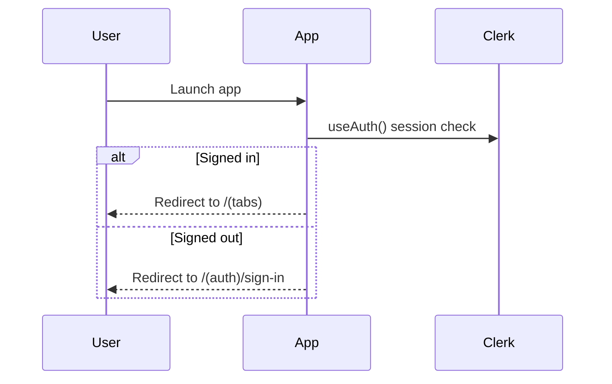
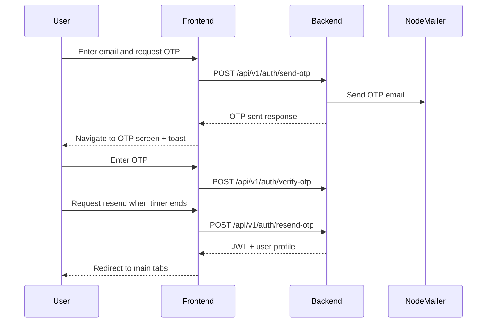
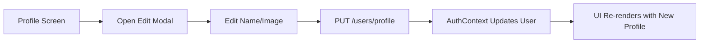
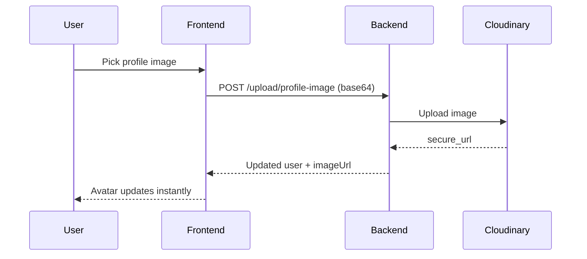
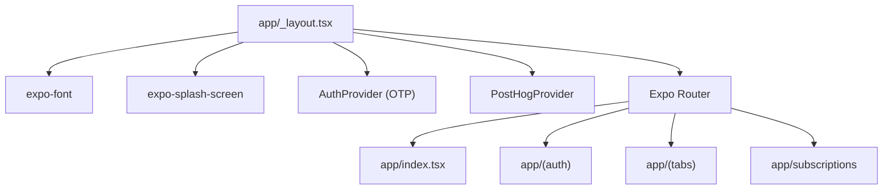
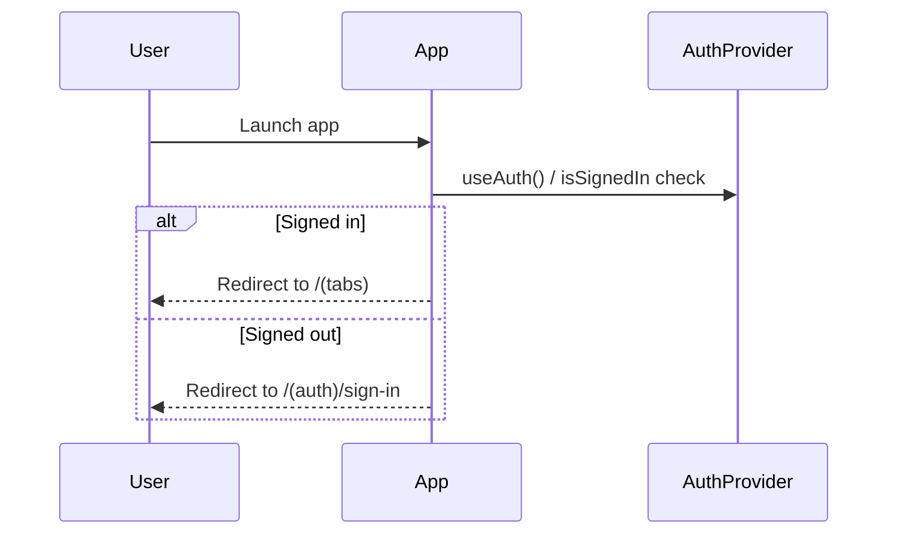
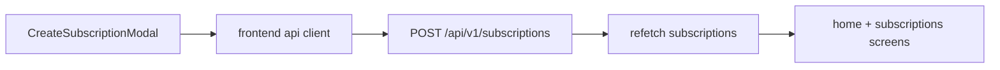

# Recurrly Frontend Documentation

## Overview

The frontend is a React Native app built with Expo SDK 54 and Expo Router. It uses OTP email authentication, NativeWind for styling, and a shared subscription store for dashboard and subscriptions views.

## Deprecated Features

### Clerk Authentication (Deprecated)

How it worked before:
- App bootstrap used `ClerkProvider` in `app/_layout.tsx`.
- Route guards used Clerk hooks (`useAuth`, `useUser`, `useClerk`) in auth/tab layouts.
- Sign-in/sign-up screens were powered by Clerk SDK hooks.

Why it was replaced:
- Product requirement moved to email OTP authentication controlled by the backend.
- Backend-managed OTP provides tighter control over verification policy, logs, and deliverability.
- Unified auth model simplifies profile and session integration with custom APIs.

Deprecated diagram (moved from previous auth flow):

## New Features

### OTP Authentication (NodeMailer)

Architecture overview:
- Auth state is managed by `AuthProvider` and persisted via secure storage.
- Frontend sends OTP request and verification calls to backend auth endpoints.
- Route guards now use custom auth context instead of Clerk.

Implementation summary:
- Frontend:
  - New OTP-first sign-in and sign-up flows.
  - Toast/banner feedback on OTP transitions.
  - Auth gate redirects based on custom auth context.
- Backend integration:
  - `POST /api/v1/auth/send-otp`
  - `POST /api/v1/auth/verify-otp`
  - `POST /api/v1/auth/resend-otp`

### Profile Management

Architecture overview:
- Profile data is sourced from auth context user state.
- Profile updates are executed through backend profile APIs.
- Edit flow uses React Native `Modal` for in-place profile editing.

Implementation summary:
- Profile screen shows name, email, profile image.
- Edit modal updates name and image URL.
- Dedicated logout path clears token and cached user state.

### Cloudinary Image Upload

Architecture overview:
- Frontend image picker captures image as base64.
- Backend upload endpoint sends image to Cloudinary and stores secure URL.
- Updated URL is pushed back into auth context and profile UI.

Implementation summary:
- Frontend:
  - Image picker integration on profile edit modal.
  - Upload request to `/upload/profile-image`.
- Backend:
  - Cloudinary upload + transformed secure image URL.

### Monthly Insights

Architecture overview:
- Insights screen reads global subscription store.
- Summary cards and category chart derive from current subscription state.

Implementation summary:
- Added monthly spend summary.
- Added active subscription count and top category highlights.
- Added category breakdown chart with dynamic bar widths.

## Technology Stack

- Expo + React Native + TypeScript
- Expo Router for file-based navigation
- Custom OTP authentication via `AuthProvider` (`context/AuthContext.tsx`) and backend auth endpoints
- NativeWind + Tailwind CSS v4 for styling
- PostHog (`posthog-react-native`) for analytics provider wiring
- Day.js and Intl for date and currency formatting

## High-Level Architecture

## App Bootstrap

The root layout in `app/_layout.tsx` does these steps:

1. Calls `SplashScreen.preventAutoHideAsync()`.
2. Loads custom Plus Jakarta Sans fonts.
3. Validates PostHog config (`EXPO_PUBLIC_POSTHOG_API_KEY`, `EXPO_PUBLIC_POSTHOG_HOST`).
4. Wraps the app in providers:
   - `PostHogProvider`
  - `AuthProvider` for OTP/JWT session state
   - `SafeAreaProvider`
  - `ToastProvider`
5. Renders an Expo Router stack with hidden headers.

## Routing And Access Control

### Route Topology

- `app/index.tsx`: auth gate and redirect entry.
- `app/(auth)/`: public authentication screens.
- `app/(tabs)/`: protected main app tabs.
- `app/subscriptions/[id].tsx`: protected subscription detail route.

### Auth Redirect Logic

### Group-Level Guards

- `app/(auth)/_layout.tsx`: uses `useAuth()` and redirects signed-in users to tabs.
- `app/(tabs)/_layout.tsx`: uses `useAuth()` and redirects signed-out users to sign-in.
- `app/subscriptions/_layout.tsx`: uses `useAuth()` with the same signed-in requirement for detail routes.

## Screen Documentation

### 1) `app/index.tsx`

- Uses `useAuth()` from custom `AuthProvider`.
- Waits for `isLoading` and then redirects:
  - Signed in -> `/(tabs)`
  - Signed out -> `/(auth)/sign-in`

### 2) `app/(auth)/sign-in.tsx`

- Uses `useAuth()` methods from `AuthProvider`: `sendOTP`, `verifyOTP`, and `resendOTP`.
- Supports OTP sign-in flow:
  - submit email -> send OTP
  - submit OTP code -> verify and receive session
  - resend OTP with cooldown timer for client trust/retry step
- Includes email and OTP validation with toast feedback.

### 3) `app/(auth)/sign-up.tsx`

- Uses `useAuth()` methods from `AuthProvider`: `sendOTP` (with name) and `verifyOTP`.
- Supports sign-up flow:
  - submit name + email -> send OTP
  - verify OTP -> account is activated and session starts
  - route to tabs after successful verification
- Includes field-level validation (required fields, valid email, OTP format). Password/confirm-password validation is not part of the current OTP-first UX.

### 4) `app/(tabs)/index.tsx` (Home)

- Renders dashboard-style home screen:
  - user header
  - balance card
  - upcoming renewals carousel
  - all subscriptions list
- Creates new subscriptions through `CreateSubscriptionModal`.
- New items are prepended in local state.

### 5) `app/(tabs)/subscriptions.tsx`

- Searchable list of subscriptions from mock data.
- Filters by:
  - name
  - plan
  - category
  - payment method
  - status
  - billing
  - price
- Supports card expansion and empty state messaging.

### 6) `app/(tabs)/settings.tsx`

- Uses `useAuth()` from `AuthProvider` for user context access.
- Displays profile/account metadata (name, email, profile image).
- Handles `signOut()` through `AuthProvider` and redirects to sign-in on success.

### 7) Placeholder Screens

- `app/onboarding.tsx`
- `app/subscriptions/[id].tsx`

These currently render placeholder UI and are planned for future implementation. `app/(tabs)/insights.tsx` now renders live monthly insights from subscription state.

## Component Library

### `components/CreateSubscriptionModal.tsx`

- Captures: name, price, frequency, category.
- Validates form data locally.
- Creates an in-memory `Subscription` object with:
  - generated ID
  - computed renewal date based on frequency
  - category color mapping

### `components/SubscriptionCard.tsx`

- Collapsed state: icon, title, meta, price, billing.
- Expanded state: payment method, category, start date, renewal date, status.
- Color theming for compact state via category color.

### `components/UpcomingSubscriptionCard.tsx`

- Compact card for upcoming renewals in the horizontal list.

### `components/ListHeading.tsx`

- Shared heading row for list sections.

## Data Model And Constants

### Global Types (`type.d.ts`)

- `Subscription`, `SubscriptionCardProps`
- `UpcomingSubscription`
- `AppTab`, `TabIconProps`
- `SubscriptionFrequency`, `SubscriptionCategory`

### Mock Data (`constants/data.ts`)

- `HOME_USER`
- `HOME_BALANCE`
- `UPCOMING_SUBSCRIPTIONS`
- `HOME_SUBSCRIPTIONS`
- `SUBSCRIPTION_FREQUENCIES`
- `SUBSCRIPTION_CATEGORIES`
- `SUBSCRIPTION_CATEGORY_COLORS`

## Styling System

Styling is token-first and class-based:

- `global.css` defines NativeWind component classes and theme variables.
- `constants/theme.ts` mirrors color/spacing/component tokens in TypeScript.
- Fonts are custom Plus Jakarta Sans variants loaded at runtime.

## Utility Functions

`lib/utils.ts` contains:

- `formatCurrency(value, currency)`
- `formatSubscriptionDateTime(value)`
- `formatStatusLabel(value)`

## Environment Variables

Required public variables:

- `EXPO_PUBLIC_API_URL` (base URL for OTP auth/profile/upload API calls)
- `EXPO_PUBLIC_POSTHOG_API_KEY`
- `EXPO_PUBLIC_POSTHOG_HOST`

## Current Limitations

1. Subscription create flow is local-only and not persisted to API.
2. Onboarding and subscription detail screens are still placeholders.
3. Mobile integration is partial: OTP auth (`/api/v1/auth/send-otp`, `/api/v1/auth/verify-otp`, `/api/v1/auth/resend-otp`) and profile/image upload APIs are wired, while full subscription persistence and all screen-level backend wiring are still pending.

## Planned Integration Path

