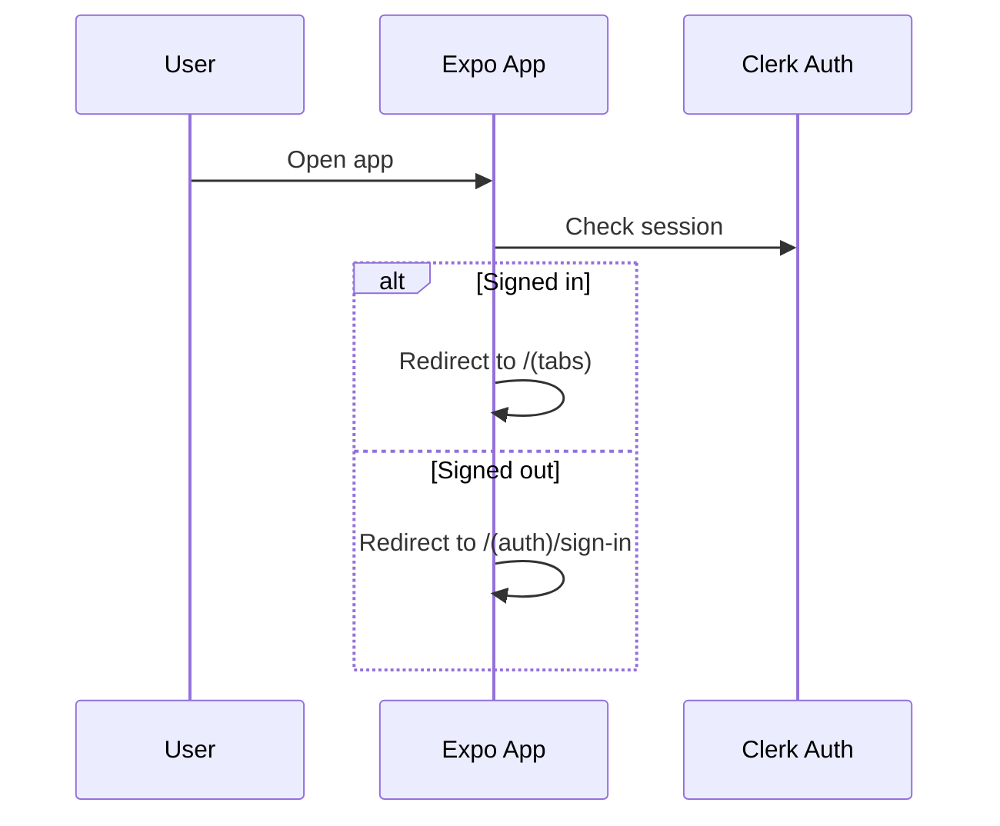
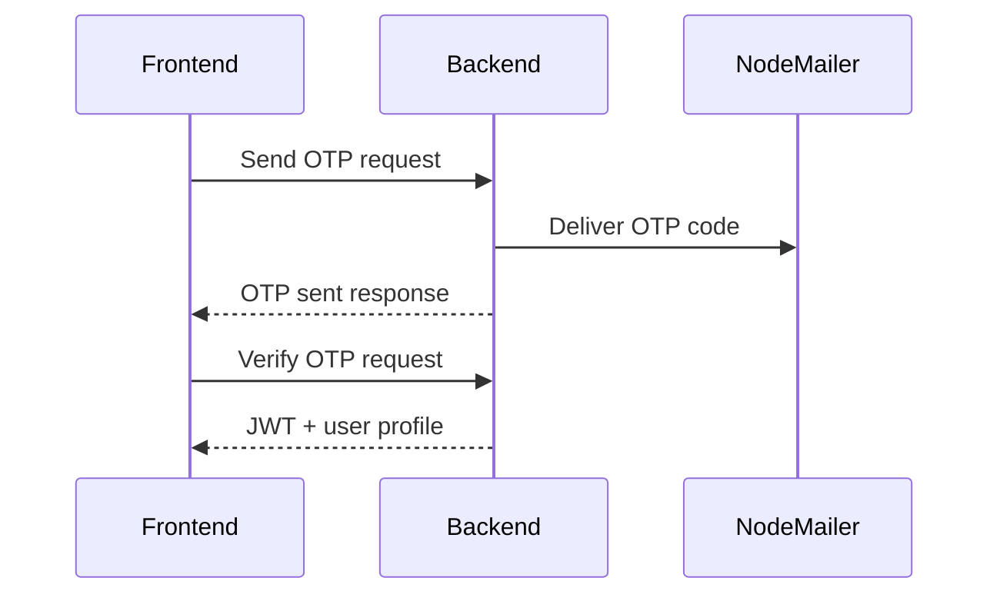
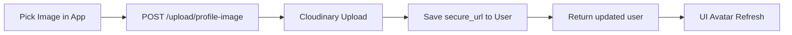
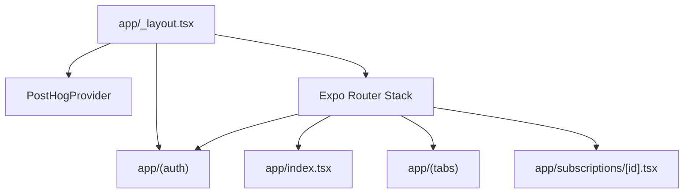
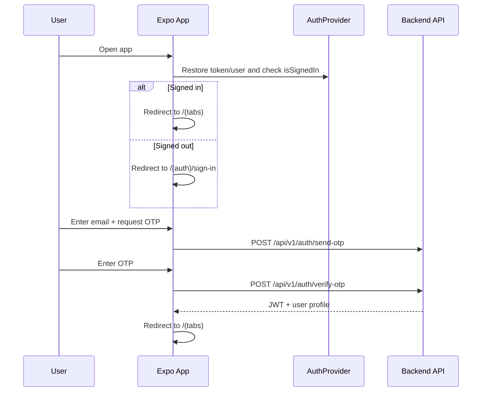
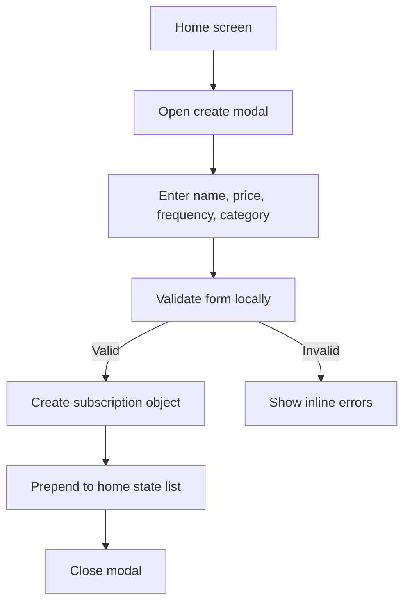
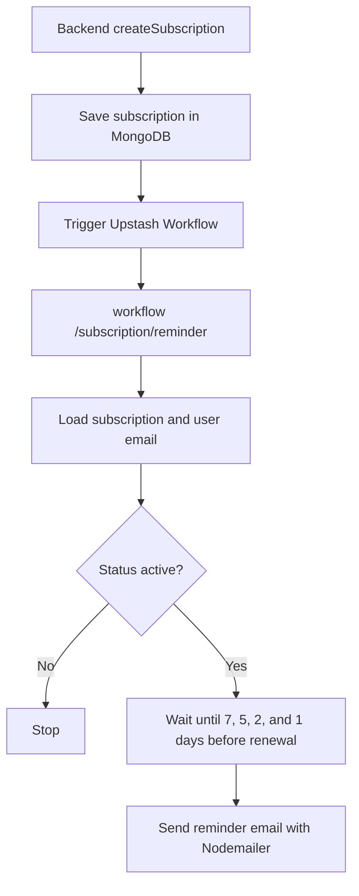
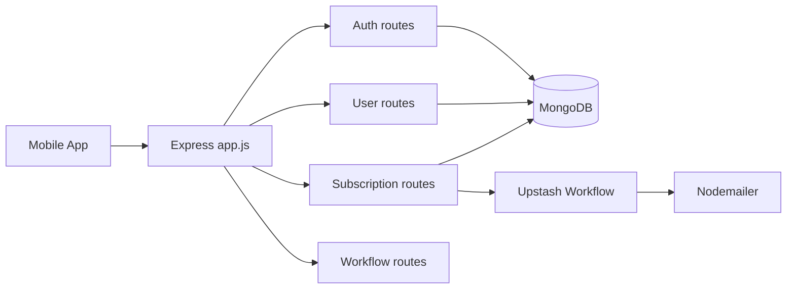

# Recurrly Project Documentation

## Overview

Recurrly is a subscription management app with two parts:

1. A React Native / Expo client that handles onboarding, authentication, subscription browsing, and local subscription creation.
2. A Node.js / Express backend that supports OTP auth, subscription persistence, reminders, and request protection.

The current app is built with Expo Router, OTP email authentication, NativeWind for styling, and a shared state layer for home/subscriptions screens. The backend uses MongoDB, JWT auth, Arcjet protection, Nodemailer email delivery, Cloudinary image hosting, and Upstash Workflow-based reminders.

## Deprecated Features

### Clerk Authentication (Deprecated)

How it worked before:
- Frontend authentication and session were powered by Clerk SDK.
- Route protection logic depended on Clerk provider and hooks.

Why it was replaced:
- Production auth requirements shifted to backend-controlled OTP.
- OTP enables first-party control over verification lifecycle and observability.

Deprecated workflow diagram:

## New Features

### OTP Authentication (NodeMailer)

Architecture overview:
- Frontend `AuthContext` handles token + user session state.
- Backend auth controller manages OTP generation/verification.
- OTP delivery is handled by NodeMailer.

API details:
- `POST /api/v1/auth/send-otp`
- `POST /api/v1/auth/verify-otp`
- `POST /api/v1/auth/resend-otp`

Implementation summary:
- Frontend sign-in/sign-up now run email -> OTP flow.
- Backend stores hashed OTP with expiry and attempt counters.
- JWT is issued after successful OTP verification.

### Profile Management

Architecture overview:
- Profile screen is integrated in tab navigation.
- Edit profile uses modal-based UX.
- Profile updates synchronize through auth context.

API details:
- `GET /api/v1/users/profile`
- `PUT /api/v1/users/profile`

Implementation summary:
- Name/email/image rendered from current user state.
- Profile edit modal supports updating name and profile image.

### Cloudinary Image Upload

Architecture overview:
- Frontend image picker selects media.
- Backend uploads image to Cloudinary and persists secure URL.

API details:
- `POST /api/v1/upload/profile-image`

Implementation summary:
- Upload response updates profile image immediately in UI.

### Monthly Insights

Architecture overview:
- Insights screen reads global subscriptions store.
- Metrics are derived from active subscriptions and billing cadence.

Implementation summary:
- Monthly spend summary card.
- Active plans count.
- Top category and category breakdown chart.

## Repository Layout

- `app/` contains the live Expo Router screens.
- `components/` contains reusable UI pieces for subscriptions, headings, and the create modal.
- `constants/` contains shared sample data, icons, images, and theme values.
- `lib/` contains formatting helpers.
- `app-example/` is the starter Expo template kept as reference material, not the main app.
- `recurrly-backend/` contains the Express API and workflow service.

## Frontend Architecture

The client uses file-based routing. The root layout loads fonts, prevents the splash screen from hiding too early, and wraps the app in AuthProvider, PostHog, Safe Area, and toast providers.

### Routing Strategy

- `app/index.tsx` checks `useAuth()` (`isLoading`, `isSignedIn`) and redirects to tabs or sign-in flow.
- `app/(auth)/_layout.tsx` keeps signed-in users out of the auth stack.
- `app/(tabs)/_layout.tsx` keeps signed-out users out of the protected tab area.
- `app/subscriptions/_layout.tsx` protects subscription detail routes the same way.

### Main Screens

#### Home

The home screen in `app/(tabs)/index.tsx` is the primary dashboard.

- It shows a user header, balance card, upcoming renewals, and the current subscription list.
- Subscription data starts from `HOME_SUBSCRIPTIONS` in `constants/data.ts` and is kept in local component state.
- The create button opens `components/CreateSubscriptionModal.tsx`.
- Tapping a subscription card expands it in place.

#### Subscriptions

The subscriptions screen in `app/(tabs)/subscriptions.tsx` is a searchable view of the same shared sample data.

- It filters by name, plan, category, payment method, status, billing, and price.
- Cards expand inline to show detailed metadata.
- Empty results show a helper state.

#### Settings

The settings screen in `app/(tabs)/settings.tsx` uses `AuthContext` user data.

- It shows profile details, account metadata, and sign-out support.
- It supports both loaded and signed-out states.

#### Auth

The sign-in and sign-up screens are custom OTP flows backed by `AuthContext`.

- They validate name/email/OTP on the client before submitting.
- They call OTP endpoints (`send-otp`, `verify-otp`, `resend-otp`) through the shared API client.
- On success, they navigate into the protected tab area.

#### Subscription Details

The dynamic route `app/subscriptions/[id].tsx` is currently a placeholder detail screen that displays the route id.

## User Flows

### Authentication Flow

### Create Subscription Flow

The current implementation is intentionally local-first. It does not yet persist new subscriptions to the backend from the mobile UI.

### Reminder Workflow

## Shared UI And Design System

The visual style is defined through NativeWind classes in `global.css` and theme tokens in `constants/theme.ts`.

- Background colors are warm and high-contrast.
- Typography uses the Plus Jakarta Sans font family.
- Tabs use a compact floating pill layout.
- Subscription cards rely on expansion rather than navigating away.

Reusable components:

- `components/SubscriptionCard.tsx` renders collapsed and expanded subscription cards.
- `components/UpcomingSubscriptionCard.tsx` renders the horizontal upcoming renewal cards.
- `components/ListHeading.tsx` standardizes section headers.
- `components/CreateSubscriptionModal.tsx` handles local form entry and validation.

## Shared Data And Types

`constants/data.ts` provides the sample content used by the current client.

- `HOME_USER` supplies the greeting name.
- `HOME_BALANCE` drives the summary card.
- `UPCOMING_SUBSCRIPTIONS` powers the horizontal renewal strip.
- `HOME_SUBSCRIPTIONS` powers the main subscription lists.
- `SUBSCRIPTION_FREQUENCIES` and `SUBSCRIPTION_CATEGORIES` feed the modal controls.

`type.d.ts` defines the global types used across the app.

- `Subscription`
- `SubscriptionCardProps`
- `UpcomingSubscription`
- `AppTab`
- `TabIconProps`
- `SubscriptionFrequency`
- `SubscriptionCategory`

## Backend Architecture

The backend is an Express API with separate layers for config, middleware, controllers, models, and workflow/email helpers.

### Backend Entry Point

- `recurrly-backend/app.js` wires JSON parsing, cookies, route registration, error handling, and database startup.
- `recurrly-backend/config/env.js` loads environment variables from the appropriate `.env.*.local` file.
- `recurrly-backend/database/mongodb.js` opens the MongoDB connection.

### Middleware

- `middlewares/auth.middleware.js` reads the bearer token, verifies it, and attaches the user document to `req.user`.
- `middlewares/error.middleware.js` converts common Mongoose errors into HTTP responses.
- `middlewares/withArcjetProtection.js` wraps handlers with Arcjet rate and bot protection.

### Controllers

#### Auth Controller

`controllers/auth.controller.js` is OTP-first and exposes send/verify/resend handlers plus sign-out.

- `sendOTP` and `resendOTP` generate/store OTP state and dispatch email via Nodemailer.
- `verifyOTP` validates the code, marks user verified, and issues JWT.
- `signUp` and `signIn` password endpoints are intentionally deprecated and return HTTP 410.
- `signOut` is a lightweight success response because JWT is stateless (client clears local session data).

This means password auth and OTP do not coexist as active flows in this codebase; OTP is the canonical entry point.

#### Subscription Controller

`controllers/subscription.controller.js` handles subscription CRUD and reminders.

- Create saves a subscription for the current user.
- Read endpoints fetch subscriptions by user or id.
- Update and delete enforce ownership checks.
- Upcoming renewals are queried from a date window around the renewal date.
- Create also triggers the Upstash workflow for reminder scheduling.

#### User Controller

`controllers/user.controller.js` exposes user list, read, update, and delete handlers.

#### Workflow Controller

`controllers/workflow.controller.js` serves the workflow callback used to schedule reminder emails.

## Backend Data Model

### User

The user schema stores:

- `name`
- `email`
- `password`
- timestamps

### Subscription

The subscription schema stores:

- `name`
- `price`
- `currency`
- `frequency`
- `category`
- `paymentMethod`
- `status`
- `startDate`
- `renewalDate`
- `user`
- timestamps

The model also auto-calculates a renewal date if one is missing and keeps the record indexed by user.

## API Surface

### Auth Routes

- `POST /api/v1/auth/send-otp`
- `POST /api/v1/auth/verify-otp`
- `POST /api/v1/auth/resend-otp`
- `POST /api/v1/auth/sign-out`

Password `sign-up`/`sign-in` handlers exist only as deprecated controller stubs and are not mounted in `routes/auth.routes.js`.

### User Routes

- `GET /api/v1/users`
- `GET /api/v1/users/:id`
- `PUT /api/v1/users/:id`
- `DELETE /api/v1/users/:id`
- `GET /api/v1/users/profile`
- `PUT /api/v1/users/profile`

`/users/profile` routes are authenticated shortcuts for operating on the current user resource.

### Subscription Routes

- `POST /api/v1/subscriptions`
- `GET /api/v1/subscriptions/user/:id`
- `GET /api/v1/subscriptions/:id`
- `PUT /api/v1/subscriptions/:id`
- `DELETE /api/v1/subscriptions/:id`
- `GET /api/v1/subscriptions/upcoming-renewals`

### Workflow Routes

- `POST /api/v1/workflows/subscription/reminder`

### Upload Routes

- `POST /api/v1/upload/profile-image`

Request: JSON body with either `base64` image data or `imageUrl`.

Response: success envelope containing updated user and `imageUrl` for immediate client avatar refresh.

## External Services

- OTP authentication (NodeMailer + JWT + AuthContext) manages mobile client sessions.
- PostHog is present as the analytics provider.
- Arcjet protects the backend from rate abuse and unwanted automated traffic.
- MongoDB stores users and subscriptions.
- Upstash Workflow schedules reminder execution.
- Nodemailer sends reminder emails through Gmail.

## Environment Variables

### Frontend

- `EXPO_PUBLIC_API_URL` (base URL used by OTP/profile/upload API calls)
- `EXPO_PUBLIC_POSTHOG_API_KEY`
- `EXPO_PUBLIC_POSTHOG_HOST`

### Backend

- `PORT`
- `NODE_ENV`
- `DB_URI`
- `JWT_SECRET`
- `JWT_EXPIRES_IN`
- `ARCJET_KEY`
- `ARCJET_ENV`
- `QSTASH_URL`
- `QSTASH_TOKEN`
- `SERVER_URL`
- `EMAIL_PASSWORD`

## Current Gaps And Starter Areas

- `app/onboarding.tsx` and `app/subscriptions/[id].tsx` are still placeholder screens.
- The mobile create-subscription flow currently updates local state only.
- Some backend edge cases are still scaffolded and need hardening.
- The `app-example/` folder is starter content and is not part of the live product flow.

## Suggested Next Steps

1. Connect the mobile create-subscription form to the backend `POST /api/v1/subscriptions` endpoint.
2. Replace placeholder screens with actual onboarding and subscription detail experiences.
3. Add request/response examples and a backend API contract section once the data flow is finalized.